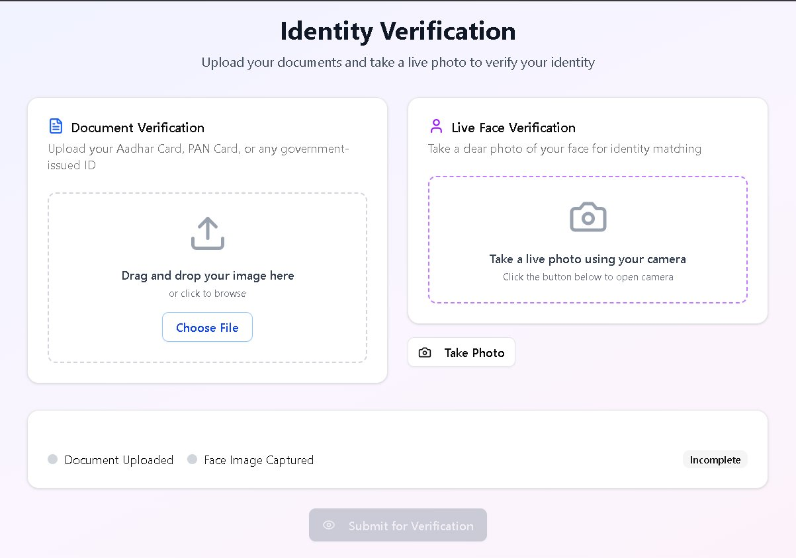
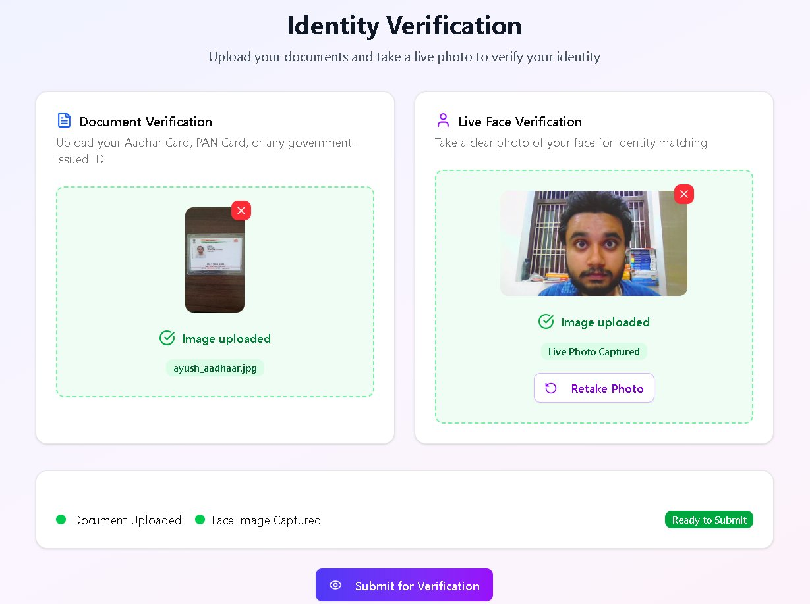
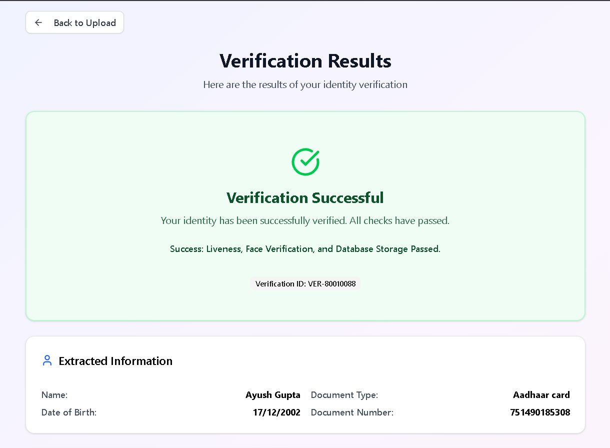
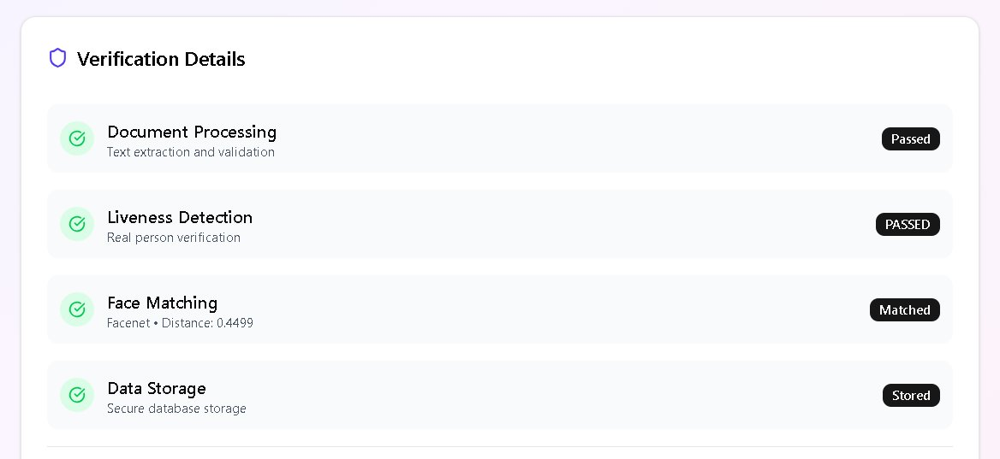
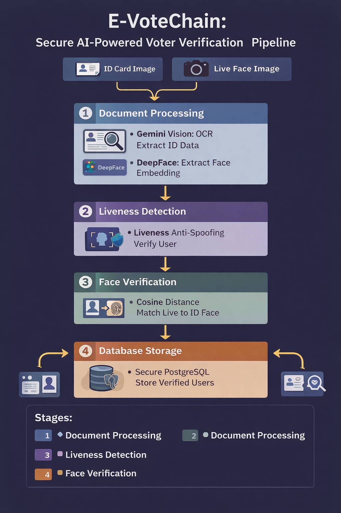

<div align="center">


[](https://python.org)
[](https://flask.palletsprojects.com)
[](https://react.dev)
[](https://postgresql.org)
[](https://ai.google.dev)
[](https://metamask.io)
[](https://docker.com)
[](LICENSE)

> **Secure. Verifiable. Tamper-proof.**
> A full-stack e-voting system combining biometric identity verification, blockchain transaction signing, and AI-powered document OCR — built to eliminate proxy voting and identity spoofing at scale.

</div>

---

## Live Demo 📽️

## Live Demo 📽️

<a href="https://drive.google.com/file/d/18NpKtWQt8e1BNvjYnfoJ9QyaeeNdB_G9/view?usp=sharing" target="_blank">
  
</a>

<a href="https://drive.google.com/file/d/1QYADebGyuPvEOV5JS32PQ1NHIHvEGRo_/view?usp=sharing" target="_blank">
  
</a>


## 🧩 The Problem

Traditional online voting systems suffer from three critical flaws:

- **Identity spoofing** — anyone can impersonate a voter with just credentials
- **Proxy voting** — physical proxies are hard to detect digitally
- **Lack of verifiability** — voters can't confirm their vote was counted correctly

E-VoteChain solves all three with a **multi-factor biometric pipeline** backed by blockchain immutability.

---

## ✅ Key Results

| Metric | Result |
|---|---|
| 🗳️ Voters supported | **500+** |
| 🪪 Onboarding accuracy (Gemini OCR) | **96%** |
| 🧬 Spoofing reduction (liveness detection) | **85%** |
| ⚡ API response time improvement | **40% faster** |
| 📈 System throughput | **2.1× improvement** |

---

## 📸 System in Action

### Step 1 — Identity Verification Page (Empty State)
> Voter lands on the verification page — uploads Aadhar/Government ID on the left and takes a live photo on the right



---

### Step 2 — Both Inputs Captured (Ready to Submit)
> Document uploaded and live face captured — both green, status shows **"Ready to Submit"**



---

### Step 3 — Verification Successful
> All checks pass — Gemini OCR extracts name, DOB, document type, and number. Liveness, Face Verification, and Database Storage all pass.



---

### Step 4 — Verification Details Breakdown
> Full pipeline result: Document Processing ✅ · Liveness Detection ✅ · Face Matching ✅ (Facenet · Distance: 0.4499) · Data Storage ✅




## 🏗️ System Architecture

```
┌─────────────────────────────────────────────────────────────┐
│                    React Frontend (TypeScript)              │
│    Register → Upload ID → Face Scan → Vote → Confirmation   │
└────────────────────────┬────────────────────────────────────┘
                         │ REST API
┌────────────────────────▼───────────────────────────────────┐
│                     Flask Backend                          │
│                                                            │
│  ┌─────────────────┐   ┌──────────────────────────────┐    │
│  │  ML Identity    │   │   Blockchain Vote Layer      │    │
│  │  Pipeline       │   │                              │    │
│  │                 │   │  MetaMask Wallet Signing     │    │
│  │  1. Gemini OCR  │   │  On-chain vote submission    │    │
│  │  2. DeepFace    │   │  Immutable audit trail       │    │
│  │     Embedding   │   └──────────────────────────────┘    │
│  │  3. Liveness    │                                       │
│  │     Detection   │   ┌──────────────────────────────┐    │
│  │  4. Cosine Sim  │   │       PostgreSQL DB          │    │
│  │     Matching    │   │  Voter sessions & state      │    │
│  └─────────────────┘   └──────────────────────────────┘    │
└────────────────────────────────────────────────────────────┘
```

---

## 🔐 ML Identity Verification Pipeline

The core of E-VoteChain is a **4-stage biometric verification pipeline** that must pass before any vote is cast:

### Stage 1 — Document OCR via Gemini API
- Voter uploads Aadhar card or Voter ID
- Gemini Vision API extracts: name, DOB, ID number, address
- Post-processing layer validates structure and handles low-res scans
- **96% extraction accuracy** on real Indian government IDs

### Stage 2 — Face Embedding via DeepFace
- Live webcam capture is passed through **DeepFace** to generate a 128-dim face embedding
- Same embedding is generated from the ID photo extracted during OCR

### Stage 3 — Liveness Detection
- DeepFace liveness module detects whether the face is from a real person or a spoofed image/video
- Rejects printed photos, screen replays, and masked faces
- **85% reduction in spoofing attempts** compared to baseline

### Stage 4 — Dual-Stage Cosine Similarity Matching
- Computes cosine similarity between:
  - Live face embedding ↔ ID photo embedding
  - Live face embedding ↔ registered voter embedding (if pre-enrolled)
- Both thresholds must pass for verification to succeed

```python
# Simplified matching logic
similarity = cosine_similarity(live_embedding, id_embedding)
if similarity >= THRESHOLD and liveness_score >= LIVENESS_THRESHOLD:
    grant_vote_access()
else:
    reject_with_reason()
```
## 🚀 System Architecture
<p align="center">
  
</p>

---

## 🗳️ Voting Flow

```
[1] Register          →  Voter submits Aadhar/Voter ID
[2] OCR Extraction    →  Gemini extracts identity fields
[3] Face Enrollment   →  DeepFace embeds and stores face vector
[4] Liveness Check    →  Live selfie verified as real person
[5] Face Match        →  Cosine similarity against registered embedding
[6] Wallet Connect    →  MetaMask wallet linked to verified identity
[7] Cast Vote         →  Vote signed and submitted on-chain
[8] Confirmation      →  Immutable receipt returned to voter
```

---

## 🛠️ Tech Stack

| Layer | Technology |
|---|---|
| **Frontend** | React 18, TypeScript, Tailwind CSS, Vite |
| **Backend** | Python, Flask, REST APIs |
| **AI / OCR** | Google Gemini API (Vision) |
| **Biometrics** | DeepFace (face recognition + liveness) |
| **Database** | PostgreSQL (voter sessions, verification state) |
| **Blockchain** | MetaMask (wallet signing + on-chain vote submission) |
| **Deployment** | Docker, Dockerfile |

---

## 📁 Repository Structure

```
Votechain_ML/
├── app.py                        # Flask entry point — API routes & orchestration
├── ml_logic/
│   ├── ocr.py                    # Gemini Vision OCR pipeline
│   ├── face_verification.py      # DeepFace embedding + liveness
│   ├── similarity.py             # Cosine similarity matching logic
│   └── utils.py                  # Preprocessing helpers
├── frontend/
│   ├── src/
│   │   ├── components/           # Registration, FaceScan, VotingUI
│   │   └── services/             # API client + MetaMask integration
│   └── package.json
├── uploads/                      # Temp storage for ID images (cleared post-verification)
├── index.html                    # Entry HTML
├── Dockerfile                    # Containerized deployment
├── requirements_final_cpu.txt    # Python dependencies (CPU-optimized)
└── README.md
```

---

## 🚀 Getting Started

### Prerequisites
- Python 3.10+
- Node.js 18+
- PostgreSQL running locally or via Docker
- Google Gemini API key
- MetaMask browser extension

### Option A — Local Setup

```bash
# 1. Clone the repo
git clone https://github.com/E-VoteChain/Votechain_ML.git
cd Votechain_ML

# 2. Backend setup
python -m venv venv
source venv/bin/activate          # Windows: venv\Scripts\activate
pip install -r requirements_final_cpu.txt

# 3. Configure environment
cp .env.example .env
# Set: GEMINI_API_KEY, DATABASE_URL, SECRET_KEY

# 4. Run Flask backend
python app.py

# 5. Frontend setup (new terminal)
cd frontend
npm install
npm run dev
# → http://localhost:5173
```

### Option B — Docker

```bash
docker build -t votechain-ml .
docker run -p 5000:5000 \
  -e GEMINI_API_KEY=your_key \
  -e DATABASE_URL=your_db_url \
  votechain-ml
```

---

## 🔒 Security Design

- **No raw biometric data stored** — only embeddings (vectors), never photos
- **Liveness detection** prevents replay attacks using static images or videos
- **One vote per verified identity** — enforced at DB level with unique voter session constraints
- **MetaMask signing** ensures votes are cryptographically tied to a wallet, not just a session
- **Upload hygiene** — ID images are processed and deleted immediately, never persisted

---

## 🧠 Challenges & Solutions

| Challenge | Solution |
|---|---|
| Low-res Indian ID scans breaking OCR | Fine-tuned Gemini prompts + post-processing validation layer |
| Face spoofing via printed photos | DeepFace liveness detection module |
| High API latency on verification chain | Modular async pipeline — each stage runs independently |
| Dual embedding mismatch at edge cases | Two-threshold system with tuned cosine similarity floor |

---

## 👥 Team

Built as part of the **E-VoteChain** initiative — a full-stack e-voting platform with biometric security for accessible, tamper-proof digital democracy.

| Role | Contributor |
|---|---|
| Frontend & ML Pipeline & Backend | [Ayush Gupta](https://github.com/Ayushlion8) |
| Blockchain | E-VoteChain Team |

---

<div align="center">

*Built with a belief that secure digital voting is not just possible — it's necessary.*


</div>
